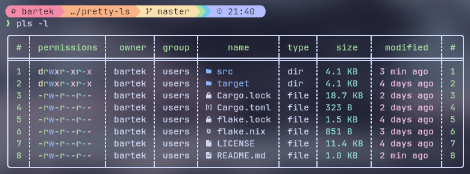

# pretty ls

A pretty ls replacement, inspired by the nushell ls.



### Features:

+ Hide files ignored by Git
+ Colorized output
+ Sorting
+ Icons

## Usage:

### pls \[Options\] \[Path\]

Arguments:

+ [\Path\] Directory to list

Options:

+ -a, --all            Show hidden files
+ -g, --gitignore      Hide files ignored by Git
+ -l, --long           Show longer information
+ -s, --sort <SORT>    Sort by name, size, modified or type \[default: name\] \[possible values: name, size, modified, type\]
+ -r, --reverse        Reverse the sort order
+ -D, --no-dirs-first  Do not group directories before files
+ -h, --help           Print help
+ -V, --version        Print version

## Examples:

+ List files in the home directory and display longer information.

```bash
pls -l ~
```

+ List files in ./pretty-ls and hide files tracked by Git.

```bash
pls -g pretty-ls
```

+ List files in Pictures and show hidden files. (...)

```bash
pls -a Pictures
```

+ List files in Downloads and sort by file size (smallest to biggest, add `-r` to go from biggest to smallest).

```bash
pls -s Downloads
```

## Run with Nix

```nix
nix run github:BluamekGD/pretty-ls
```

This compiles and runs the latest source.

Nothing gets installed on your system. If you wanna install it, see the instructions below.

## NixOS

1. Add this input to your flake.

```nix
pretty-ls = {
  url = "github:BluamekGD/pretty-ls";
  inputs.nixpkgs.follows = "nixpkgs";
};
```

2. Add to system (or home) packages

```nix
environment.systemPackages = with pkgs; [
  inputs.pretty-ls.packages.${pkgs.stdenv.hostPlatform.system}.default
];
```

3. Rebuild NixOS

## Linux

Get the binary from the [Releases](../../releases/latest) page or build from source following the steps below.

1. Clone this repository and go into it

```bash
git clone https://github.com/BluamekGD/pretty-ls.git && cd pretty-ls
```

2. Build release

```bash
cargo build --release
```

Output binary is ``pls`` in ``./target/release``.

## Windows

Not supported, sorry!

## macOS

There's no official support but since macOS is a Unix-based system it ***might*** work. Try it but don't expect it to work perfectly.

# License

This project is licensed under the Apache 2.0 License. See [LICENSE](LICENSE) for details.

#

### Note: I used Claude for sorting and debugging so if y'all care about that then keep that in mind.
